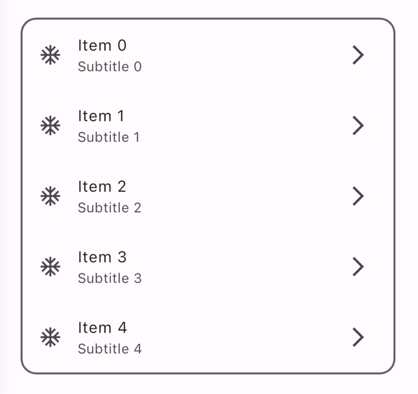
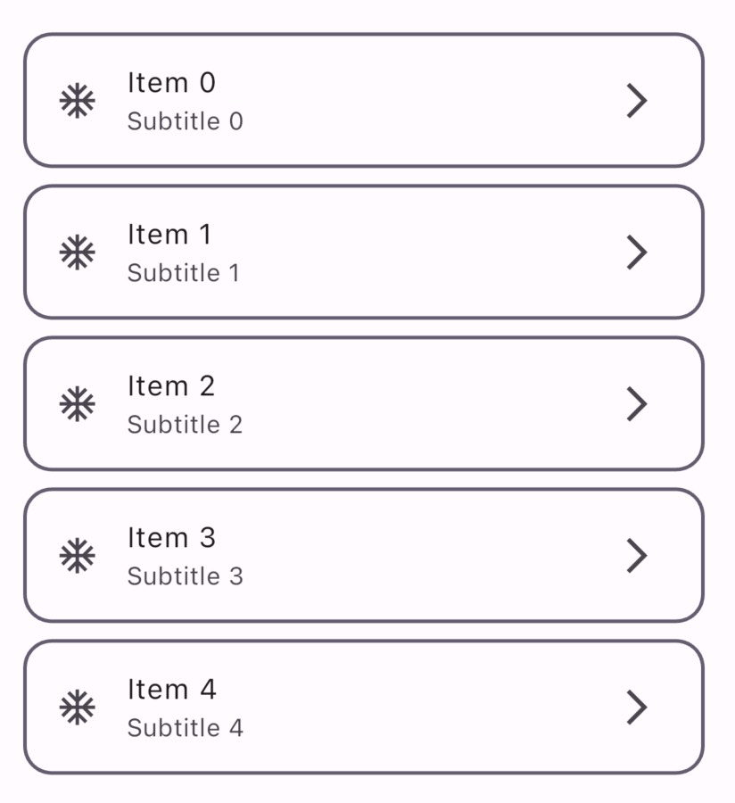

# Social Design System

Social Design System (SDS) is an Elegant UI/UX library crafted specifically for building social like applications. This is an open source project that you can fork and make PR.

## TODO

- all the entry screen and other widgets from social kit.
- light & dark mode
- TextField
- Buttons
- TextFormField
- Floating Action button
- IconButton
- segmentedbutton
- badget
- LinearProgressIndicator
- SnackBar
- AlertDialog
- BottomSheet
- Card
- Divider
- ListTile
- AppBar
- Bottom App Bar
- NavigationBar
- NavigationDrawer
- NavigationRail
- TabBar
- Checkbox
- Chip


## Sample UI of Social Deisgn System
|      |           |         |
| -------------------------- | --------------------- | --------------------------- |
| ComicListView | ComicListView.builder  | ComicListView.separated  |


## Themes

SDS provides the following themes:

- Sleek
- Comic

## Philosophy of SDS

- We design with flutter theme as much as possible. This means, developers are not needed to learn anything about the SDS. They can continue working with their code and Social Design System will naturally update the look.

- How to apply SDS to your button?

Applying `ComicTheme` to your button.
```dart
Theme(
    data: ComicThemeData.of(context),
    child: TextButton('Hello, World!'),
)
```

or you can apply the `ComicTheme` to all of your buttons in the app.

```dart
Theme(
    data: ComicThemeData.of(context),
    child: MaterialApp( ... )
)
```

then, all the buttons will use `ComicTheme`.

The theme (for instance `ComicTheme`) provides UI design to most of the flutter widgets that have visibility and if it works alone without a subset. For instance, button widget work a lone while list view widget work with a child widget. So, the theme does not provide and UI for the list view widget. Instead, it provides a special widget named `ComicListView`.

- There are some cases we cannot acheive good UI with theming, like designing the list view and list tile together. In this caase we provide speial widgets like `ComicListView` or `SleekListView`.


- Developers can choose their color scheme and all the widgets will follow the chosen color.


