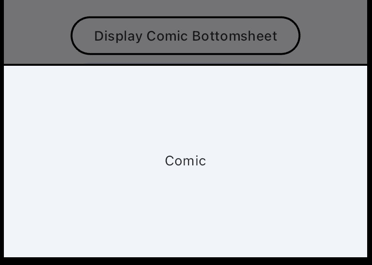

# Bottom Modal Sheet

Comic has theme for Bottom Modal Sheet



## How To Apply

```dart
ElevatedButton(
onPressed: () => showModalBottomSheet(
    context: context,
    builder: (context) => Theme(
        data: ComicTheme.of(context),
        child: BottomSheet(
            onClosing: () {},
            builder: (context) => const SizedBox(
                height: 200,
                    child: Center(
                        child: Text('Comic'),
                    ),
                ),
            ),
        ),
    ),
    child: const Text('Display Comic Bottomsheet'),
),
```
