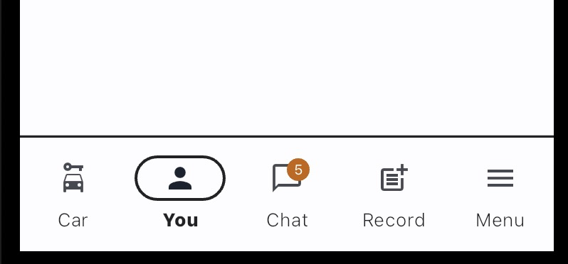

# Bottom Navigation Bar

Comic design also gives bottom navigation bar a style.

However, currently, there is no top outline in the theming for Navigation Bar. By default there will be no top outline. To add an outline NavigationBar must be a child of a Container with a BoxDecoration that has Border at top (it will be shown in example code below).



## How to apply

Check this example code.

```dart
Theme(
    data: ComicTheme.of(context),
    child: Scaffold(
        // ... body
        bottomNavigationBar: NavigationBarTheme(
            data: ComicTheme.of(context).navigationBarTheme,
                child: Container(
                    decoration: BoxDecoration(
                        border: Border(
                        top: BorderSide(
                            color: Theme.of(context).colorScheme.onBackground,
                            width: 1.6,
                        ),
                    ),
                ),
                child: NavigationBar(
                    selectedIndex: index,
                    onDestinationSelected: (v) {
                        setState(() {
                            index = v;
                        });
                    },
                    destinations: [
                        const NavigationDestination(
                            icon: Icon(Icons.car_rental),
                            label: '실버스',
                        ),
                        const NavigationDestination(
                            icon: Icon(Icons.person),
                            label: '모임',
                        ),
                        const NavigationDestination(
                            icon: Icon(Icons.post_add),
                            label: '게시판',
                        ),
                        const NavigationDestination(
                            icon: Icon(Icons.menu),
                            label: '메뉴',
                        ),
                    ],
                ),
            ),
        ),
    ),
)
```
