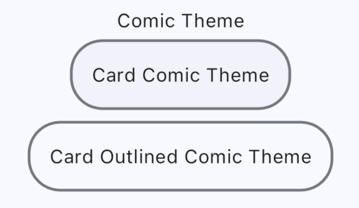

# Card 

- Comic theme does not give elevation for the `Card` widget
- by default the `Card` widget has elevation, with comic theme the elevation is removed. 
- Comic theme does not give theme design for the `Card` widget variant `Card.filled()` since comic theme should be a comic like design, 
- The Card widget and the Card.outline() variant share the same theme design, so you can use either one.




### Card Widget
```dart
Theme(
    data: ComicTheme.of(context),
    child: const Card(
        child: Padding(
        padding: EdgeInsets.all(16.0),
        child: Text(
            'Card Comic Theme'),
        ),
    ),
),
```
### Card.outline
```dart
 Theme(
    data: ComicTheme.of(context),
    child: const Card.outlined(
        child: Padding(
        padding: EdgeInsets.all(16.0),
        child: Text(
            'Card Outlined Comic Theme'),
        ),
    ),
),
```


