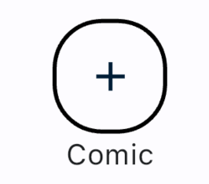

# Comic Floating Action Button



### Comic Floating Action Button Usage

Here is an example of using `FloatingActionButton()`

```dart
class _ComicScreenDemoState extends State<ComicScreenDemo>{

  @override
  Widget build(BuildContext context) {
    return Theme(
      data: ComicThemeData.of(context),
      child: Scaffold(
        appBar: //your app bar here
        body: // your app body here

        floatingActionButton: FloatingActionButton(
          onPressed: () {},
          child: const Icon(Icons.add),
        ),
      ),
    );
  }
}
```