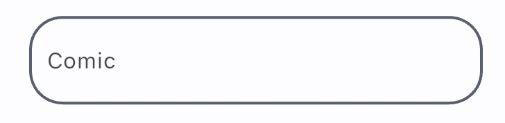

# Input

Comic has theme for TextField and TextFormField

## Text Field



To apply, apply the following code:

```dart
Theme(
    data: ComicThemeData.of(context),
    child: const TextField(
        decoration: InputDecoration(
            labelText: 'Comic',
        ),
    ),
),
```

```dart
Theme(
    data: ComicThemeData.of(context),
    child: TextFormField(
        decoration: const InputDecoration(
            labelText: 'Comic',
        ),
    ),
),
```
