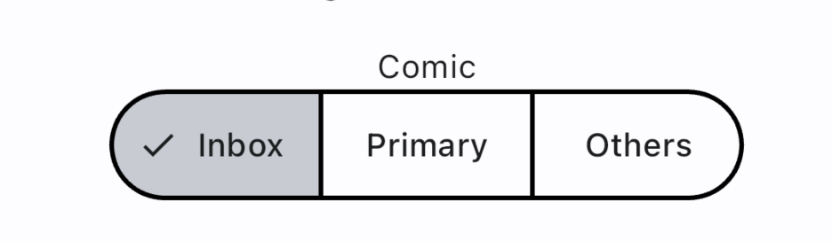

# Comic Segmented Button





## How to apply

```dart
class _SegmentedButtonsState extends State<SegmentedButtons> {
  Set<String> _selected = {'value1'};

  void updateSelection(Set<String> newSelection) {
    setState(() {
      _selected = newSelection;
    });
  }

  @override
  Widget build(BuildContext context) {
    return Theme(
      data: ComicThemeData.of(context),
      child: Column(
        children: [
          const Text('Comic'),
          SegmentedButton(
            selected: _selected,
            segments: const [
              ButtonSegment(value: 'value1', label: Text('Inbox')),
              ButtonSegment(value: 'value2', label: Text('Primary')),
              ButtonSegment(value: 'value3', label: Text('Others')),
            ],
            onSelectionChanged: updateSelection,
          ),
        ],
      ),
    );
  }
}
```