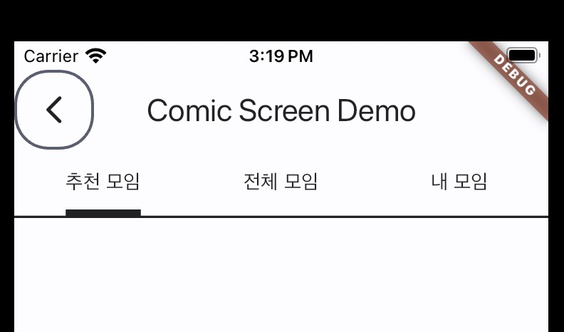

# Tab Bar

Comic Theme provides a theme for Tab Bar



## How to apply

```dart
Theme(
    data: ComicThemeData.of(context),
    child: Scaffold(
        appBar: AppBar(
            title: const Text('Comic Screen Demo'),
            bottom: TabBar(
                controller: _tabController,
                tabs: const [
                Tab(text: 'First'),
                Tab(text: 'Second'),
                Tab(text: 'Third'),
                ],
            ),
        ),
        body: TabBarView(
            controller: _tabController,
            children: const [
                Center(child: Text('First')),
                Center(child: Text('Second')),
                Center(child: Text('Third')),
            ],
        ),
    ),
);
```
