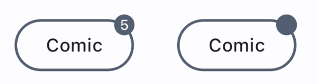

# Comic Badge


`Badge` are used for notifying the user about a certain thing. 




```dart
Badge(
    isLabelVisible: true,
        label: Text('5'),
        smallSize: 8,
),
```

## How to apply

Here is a simple example on how to apply `ComicTheme` to `Badge`.

```dart
class Badges extends StatelessWidget {
  const Badges({super.key});

  @override
  Widget build(BuildContext context) {
    return Theme(
      data: ComicThemeData.of(context),
      child: SizedBox(
        height: 40,
        width: 100,
        child: Stack(
          children: [
            ElevatedButton(
              onPressed: () {},
              child: const Text('Comic'),
            ),
            const Align(
              alignment: Alignment(.8, -1.3),
              child: Badge(
                largeSize: 16,
                isLabelVisible: true,
                label: Text('5'),
              ),
            ),
          ],
        ),
      ),
    );
  }
}
```