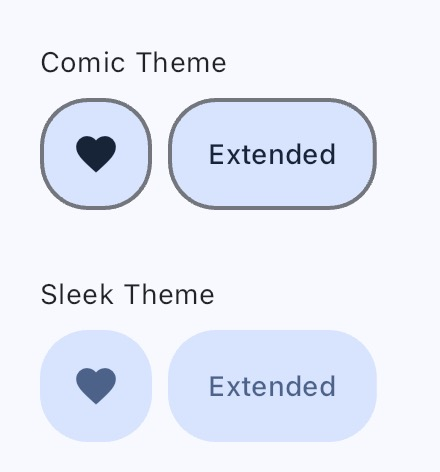

# Floating Action Button

Flutter is not using any color from the colorScheme as default value for border. For Floating Action Button, Social design uses `outline` from the colorScheme as color for the border.

In coding, there is nothing to learn more. Simply apply the theme and continue the way Flutter is coded.
