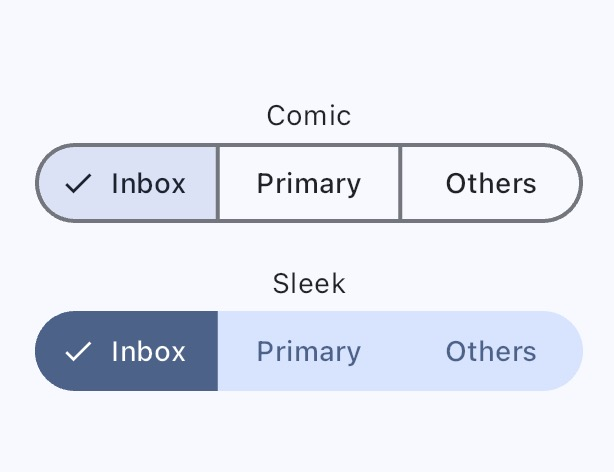

# Segmented Button

## Segemented Button in Sleek Theme

The idea of sleek design is solid, unbordered. Therefore, Social Design System (a.k.a. SDS) must remove the border. However, the default color for background it uses might be surface that does not follow/look like the sleek idea when we removed the border. That is why SDS gave color for selectedBackgroundColor, selectedForegroundColor, and backgroundColor.

These are the colors used by the theme:

- selectedBackgroundColor: `primary`,
- selectedForegroundColor: `onPrimary`,
- backgroundColor: `primaryContainer`

## How to code

There is not much to learn more in coding. Simply the code in the Flutter way.
