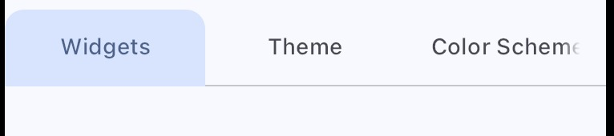

# Tab Bar

Comic Tab Bar:

Sleek Tab Bar:

For sleek Tab Bar, Social Design System (SDS) used a specific color from the color scheme to used in the indicator box.

- indicator's decoration's color: `primaryContainer`

## How to apply

Simply follow how Flutter is usually coded.
